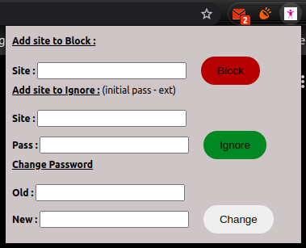
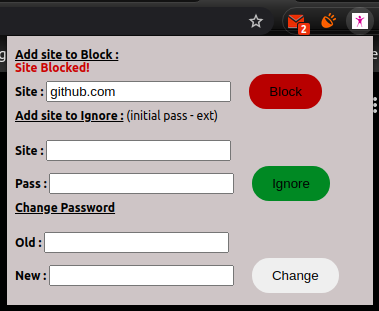
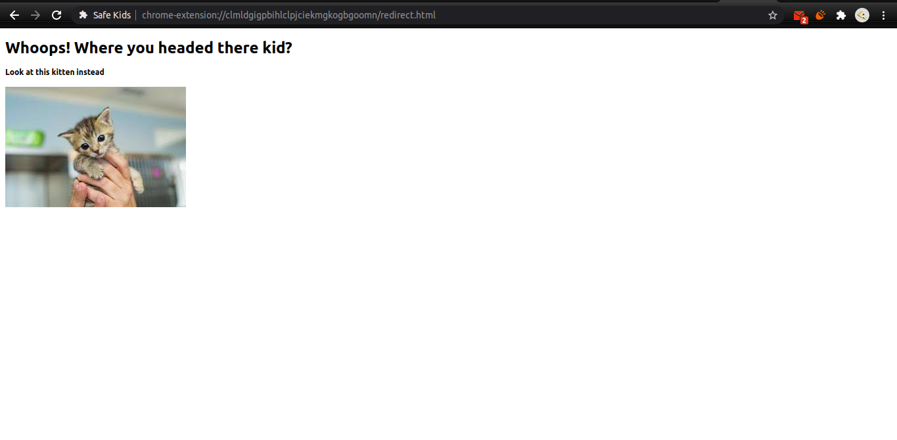
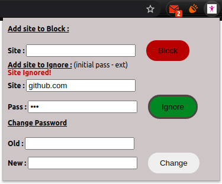

# SafeKids Chrome Extension

A chrome extension to auto block harmful sites and replace bad words for a safer web experience for children. Provision for manual addition/deletion of sites to block. 

Technologies: Used Javascript, HTML/CSS as backend and frontend technologies respectively.

## Example Usage:

Clone this repository `git clone https://github.com/tanny411/SafeKids.git`

Add it as a extension in chrome.

Now you should be able to see the extension working. Click on the safekids browser button.

A list of `bad` pages is already set in this extension. If you want to block additional websites, add them to the blocked list.

Now if you try to access the blocked sites, you will see this.

Change the password so that others cannot manipulate the list of sites to block/ignore. Made a mistake? Or blocked only tempporarily? Unblock it, or ignore any of the listed sites.

